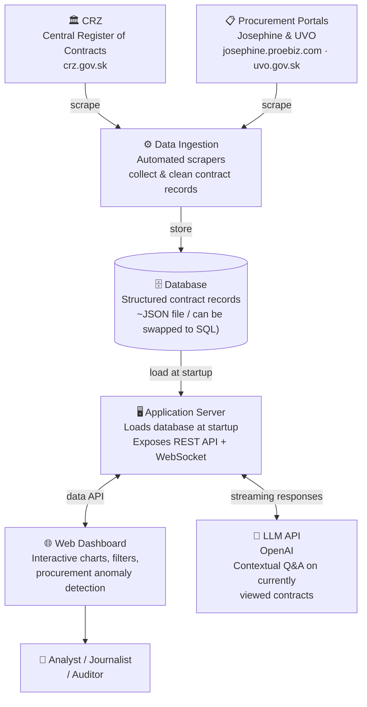

# GovLens — Simple Architecture Overview

## What it does

GovLens monitors Slovak public procurement: it collects contract data from official government portals, stores it, and lets users explore it through an interactive web dashboard with AI-powered analysis.

---

## Architecture Diagram

---

## Three-step description

### 1 — Data Collection (Ingestion)
Automated scripts pull contract records from two official Slovak government sources:
- **CRZ** (Central Register of Contracts) — all published government contracts with prices, parties, and PDF attachments.
- **Josephine & UVO** (Procurement Portals) — public tender announcements and evaluation results.

The scrapers clean and normalise the data (price formats, dates, supplier names) and store it in a database.

### 2 — Application Server
At startup, the server loads the full database into memory and exposes a fast query API. It handles filtering, sorting, aggregations, trend analysis, and anomaly detection across thousands of contracts — all without hitting the database on every request.

### 3 — AI Layer (Runtime)
When a user asks a question in the chatbot, the server sends the relevant contract context to an external **LLM API (OpenAI)** and streams the answer back in real time. The AI is scoped to the contracts currently on screen — it cannot answer questions outside the active dataset, which keeps answers grounded and verifiable.

---

## What we deliberately left out for simplicity

| Aspect | Reality | Simplified as |
|--------|---------|---------------|
| Sources | 3 portals (CRZ, Josephine, UVO) | "2 sources" (contracts + tenders) |
| Storage | Flat JSON files | "Database" |
| LLM uses | Chatbot Q&A + PDF text extraction | "LLM API for Q&A" |
| Frontend | React SPA with 10 screens | "Web Dashboard" |
